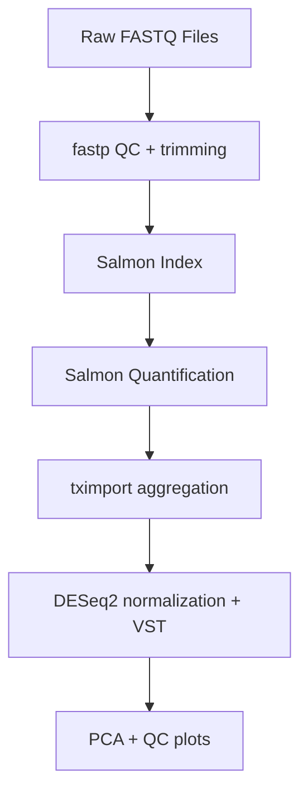

# RNA-seq Differential Expression Pipeline (fastp + Salmon + tximport + DESeq2)

**Author:** Samantha Lane, M.S. Bioinformatics Student, Johns Hopkins University  
**Dataset:** SRP075484 – BET inhibitor treatment (GEO: GSE81698)  
**Citations:** [/sources.md](https://github.com/splane00/rna-seq-pipeline/blob/main/sources.md)

## Quick Start
1. Clone the repository
```
git clone https://github.com/splane00/rna-seq-pipeline.git
cd rna-seq-pipeline
```
2. Create the conda environment
```
conda env create -f environment.yml
conda activate rna-seq-pipeline
```
3. Run the pipeline from the repo root  
```
bash run_pipeline.sh
```
The pipeline performs:
fastp QC + adapter trimming

**Requirements:**
- macOS or Linux
- Salmon ≥ 1.10
- fastp
- MultiQC
- Bash

Outputs are written to:  
results/  

## Overview
This repository contains a modular, reproducible RNA-seq preprocessing and normalization pipeline built around lightweight modern tools:  
- fastp for QC + trimming. 
- Salmon (selective alignment) for quantification
- tximport to aggregate transcript-level estimates  
- DESeq2 for normalization + variance stabilization  
- PCA and QC visualizations for exploratory analysis  
The workflow follows current recommendations for quantification-based RNA-seq analysis and is suitable for teaching, research, and portfolio demonstration.  

### Dataset (SRP075484)
This study profiles **transcriptional responses to BET bromodomain inhibition.**  
Although the dataset does **not** include classical controls or replicates, it is ideal for demonstrating preprocessing, normalization, and exploratory QC in a real-world setting.  

Data identifiers:
Resource | Accession 
:--: | :--:  
SRA Project| SRP075484 
GEO Series| GSE81698 
BioProject| PRJNA322328 
Organism| Homo sapiens 

Raw FASTQ files were downloaded from ENA and processed end-to-end through the pipeline.

## Directory Structure
```text
rna-seq-pipeline/
├── metadata/
│   └── samples.tsv           # Sample metadata
├── data/
|   ├── qc/
│   ├── raw/                  # Raw FASTQs   (ignored in Git)
│   ├── trimmed/              # fastp output (ignored)
│   └── reference/            # Transcriptome, index, tx2gene
├── docs/                     # Sources, notes, diagrams
├── results/
│   ├── qc/                   # fastp + MultiQC reports
│   ├── salmon/               # quant.sf outputs
│   └── deseq2/               # PCA, heatmaps, VST, normalized counts
├── scripts/
│   ├── qc_fastp.sh
│   ├── salmon_index.sh
│   ├── salmon_quant.sh
│   ├── deseq2_analysis.R
|   ├── multiqc.sh
├── run_pipeline.sh           # End-to-end pipeline driver
├── environment.yml           # Conda environment
├── exploratory_analysis.md   # Analysis of pipeline output  
└── README.md
```

### Pipeline Diagram


### Generated Outputs
```
fastp QC:  
results/qc/*.html
results/qc/*.json

Salmon quantification:
results/salmon/SAMPLE_NAME/quant.sf

DESeq2:
results/deseq2/normalized_counts.tsv
results/deseq2/variance_stabilized.tsv
results/deseq2/PCA_plot.png
results/deseq2/sample_distance_heatmap.png
```

### Limitations

This dataset contains no replicates, so differential expression is not performed.
Instead, the pipeline focuses on:
- normalization
- QC
- PCA
- reproducible workflow design
The structure supports DE testing if a replicated dataset is later added.

### Future Enhancements  
v0.3.0 – Add tximport + DESeq2 differential expression  
v0.4.0 – Add plots (PCA, heatmap, MA plot, volcano)  
v0.5.0 – Add Snakemake or Nextflow version  
