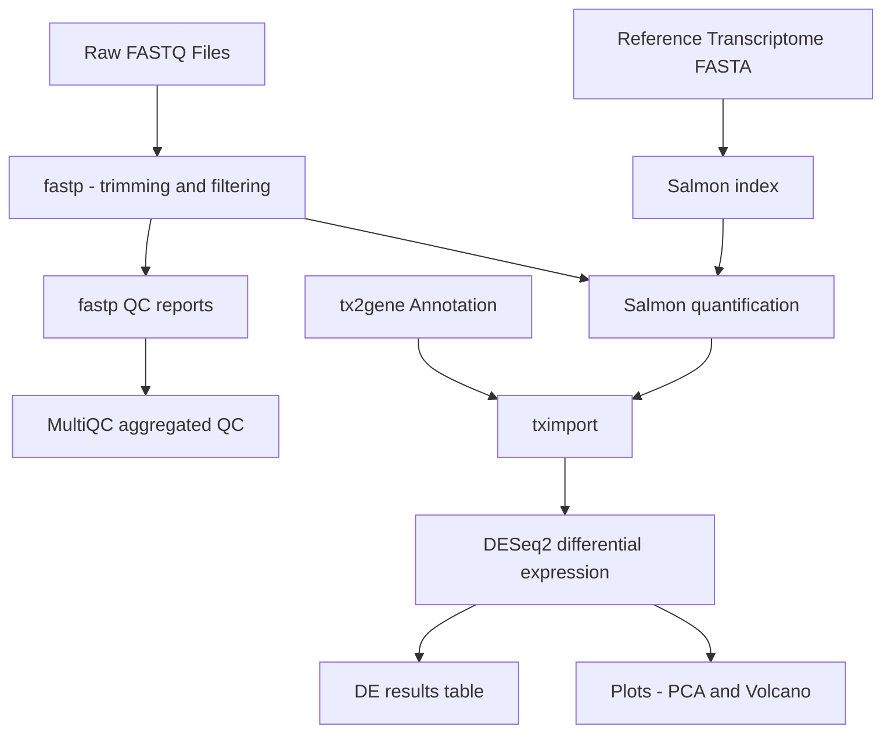

# RNA-seq Differential Expression Pipeline (Salmon + DESeq2)

**Author:** Samantha Lane, M.S. Bioinformatics at Johns Hopkins University  

A modular, reproducible RNA-seq differential expression pipeline using
fastp for QC and trimming, Salmon for alignment-free quantification,
and DESeq2 for downstream statistical analysis.

The pipeline is demonstrated on public RNA-seq data from SRP075484
(BioProject PRJNA322328; GEO GSE81698), consisting of four treatment-condition
samples with no explicit control group.

#### [Reference Page](https://github.com/splane00/rna-seq-pipeline/sources.md)

## Repository Structure

```text
rna-seq-pipeline/
├── data/
│   ├── raw/
│   ├── trimmed/
│   └── reference/
├── scripts/
│   ├── qc_fastp.sh
│   ├── salmon_index.sh
│   └── salmon_quant.sh
├── results/
│   ├── qc/
│   └── quant/
├── config/
│   └── samples.tsv
├── .gitignore
├── README.md
└── environment.yml
```

## Tools Used

| Stage               | Tool               | Purpose                                      |
|---------------------|--------------------|----------------------------------------------|
| QC                  | FastQC             | Per-sample read quality assessment           |
| QC summary          | MultiQC            | Aggregated QC report across all samples      |
| Trimming            | fastp              | Adapter removal and quality filtering        |
| Quantification      | Salmon (v1.10.3)   | Alignment-free transcript quantification     |
| Differential expression | DESeq2         | Statistical testing and normalization        |
| Import / summarization | tximport        | Import Salmon quantifications into DESeq2    |


## Pipeline Overview

This RNA-seq pipeline processes raw FASTQ files through trimming, quality control, transcript quantification, and differential expression analysis using modern, lightweight tools (fastp, Salmon, tximport, DESeq2). The workflow is modular, reproducible, and designed for quantification-based RNA-seq best practices.

### Workflow Diagram  


### Quality Control (FastQC + MultiQC)  
- FastQC run on all raw FASTQs:  
  fastqc *.fastq --outdir ../qc/raw_fastqc  
- MultiQC summary (pending MultiQC install):  
  multiqc ../qc/raw_fastqc -o ../qc/raw_multiqc  

### Trimming (fastp)  
Each sample was adapter- and quality-trimmed using fastp:  
``` text
fastp \  
  -i SRR15074527_1.fastq \
  -I SRR15074527_2.fastq \
  -o ../trimmed/SRR15074527_1.trimmed.fastq \
  -O ../trimmed/SRR15074527_2.trimmed.fastq \
  --detect_adapter_for_pe \
  --html ../trimmed/SRR15074527.fastp.html \
  --json ../trimmed/SRR15074527.fastp.json
```
All trimmed reads stored in: data/trimmed/
MultiQC-ready fastp reports also generated.

### Reference Preparation (GENCODE v45)
Downloaded:
gencode.v45.transcripts.fa.gz (used for Salmon index)
gencode.v45.annotation.gtf (used later for tximport + DESeq2)

Stored in: data/reference/

### Salmon Indexing
Index built using:
``` text
salmon index \
  -t gencode.v45.transcripts.fa.gz \
  -i salmon_index \
  -k 31
```
Index stored in:data/reference/salmon_index/

### Salmon Quantification (Alignment-Free)
Quantified all 4 paired-end samples:
```bash
for SRR in SRR15074527 SRR15074528 SRR15074529 SRR15074530
do
  salmon quant \
    -i data/reference/salmon_index \
    -l A \
    -1 data/trimmed/${SRR}_1.trimmed.fastq \
    -2 data/trimmed/${SRR}_2.trimmed.fastq \
    -p 8 \
    -o data/quant/${SRR}
done
```

Each sample now has a directory containing:  
quant.sf  
cmd_info.json  
lib_format_counts.json  
aux_info/  

These quant.sf files will be used for DESeq2.  

## Planned Extensions
- Integrate tximport for gene-level counts
- Perform DESeq2-based differential expression
- Generate PCA, heatmaps, and volcano plots
- Add a Snakemake or Nextflow workflow for full reproducibility

### Notes
All steps are run on macOS using conda environments and Homebrew-installed tools.
Project is designed to be modular, so components can be swapped out (e.g., STAR alignment instead of Salmon).
This pipeline will eventually include full reproducibility and possibly a Snakefile or Nextflow script.

## How to Run


## Requirements


## Results Preview

---

## **DESeq2 Quickstart**

A full DESeq2 walkthrough is available in `docs/DESeq2.md`. The repository also includes a runnable script and an RMarkdown report to perform differential expression, PCA, heatmaps, and volcano plots from Salmon quantifications.

Quick start (create environment and run):

```bash
# create environment from the provided template (adjust channels/versions if needed)
conda env create -f environment.yml
conda activate rna-seq-pipeline

# inside R (if needed) install Bioconductor packages
R -e "if (!requireNamespace('BiocManager', quietly=TRUE)) install.packages('BiocManager'); BiocManager::install(c('tximport','DESeq2','apeglm','org.Hs.eg.db'))"

# run non-interactive analysis (outputs -> results/deseq2/ and results/plots/)
Rscript analysis/RNAseq_DESeq2.R
```

Notes:

- Edit `metadata/samples.tsv` before running to match your samples and conditions.
- The script expects Salmon outputs at `data/quant/<SRR>/quant.sf`.
- For gene-level import add a `tx2gene` mapping and set `txOut = FALSE` in `tximport()`.
